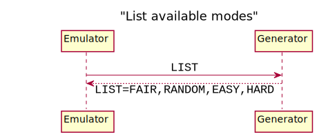
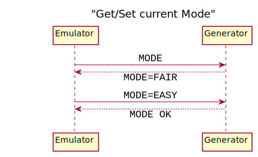
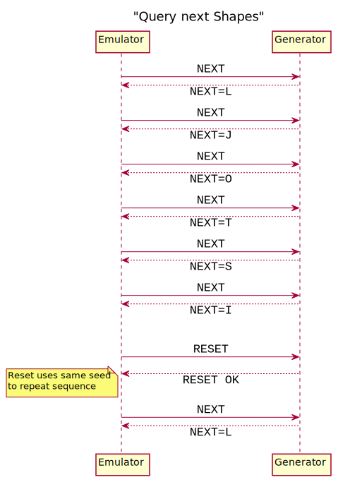

# TETRIS Generator

You will find a pre-compiled executables for the ESPL TETRIS block generator in this directory:

General documentation on the opponents can be found here: https://github.com/alxhoff/FreeRTOS-Emulator/wiki/Opponents

## Example Usage:

```
./tetris_generator [-v] [--host HOSTNAME] [--port PORT]
```

## Parameters:

- `--verbose`, `-v`
Shows detailed logging output if toggled on
*Default:* false

- `--host`, `-h`
Hostname of the system running the Game/Emulator
*Default:* localhost

- `--port`, `-p`
Port the transmission (TX) socket. (RX will use port+1)
*Default:* 1234

## Message Sequence Charts

You can find some figures below to get an idea of the available commands and responses.

*Hint:* The dotted lines are initiated by the Generator, you only have to implement the Emulator-side of the communication by sending the commands `MODE,SEED,LIST,RESET,NEXT` and receiving the corresponding result.

Set values by appending an `=VALUE` to the command. If successful the response will look like this: `[COMMAND] OK`. In the case of an error, the following should be returned: `[COMMAND] FAIL`.






## Debugging Advice

1. Enable verbose mode to see what is happening: Addend `-v` or `--verbose` to the command
2. Install `socat` to listen/write to the socket manually like this:
  - `socat - udp4-listen:1234,reuseaddr,fork` -> Listens to messages by the Emulator without running the Generator
  - `echo -n "NEXT" | socat - udp-sendto:127.0.0.1:1235` -> Write message to the Generator without using the Emulator
  
## Description of available modes

Currently 5 modes are available:

information about the 4 available modes:

- `FAIR`: Default Tetris behavior (1/7 chance per shape but it is impossible to wait for a certain block longer than 7+6=13 blocks and also the same shape can only appear twice)
- `RANDOM`: Naive Randomness (1/7 chance per shape which potentially allows long runs of good/bad blocks)
- `EASY`: Randomness with increased likelihood of good blocks (70% chance for I,L,J,O, 30% chance for S,Z,T)
- `HARD`: Randomness with increased likelihood of bad blocks (30% chance for I,L,J,O, 70% chance for S,Z,T)
- `DETERMINISTIC`: Hardcoded sequence of 7 shapes (only the starting index is randomized)
